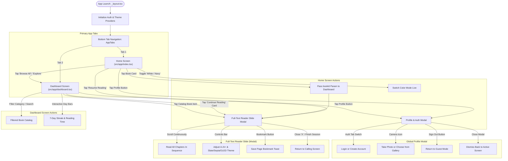

# FreeLib - Digital Library Mobile Application 📚

A modern, responsive, and intuitive digital library application built with **React Native** and **Expo (v57)**. Designed with a clean, neat **White & Navy Blue** aesthetic, FreeLib provides users with uninterrupted full-text reading, personal reading progress tracking, and account management.

---

## 👨‍🎓 Student Information

- **Student Name:** John Cez Casupanan
- **Section / Class:** `[Insert Your Section Here, e.g., BSIT 3-A / CS-301]`
- **Course / Subject:** `[Insert Course/Subject Name, e.g., Mobile Application Development]`
- **Instructor / Professor:** `[Insert Instructor Name]`
- **Academic Year / Term:** 2025–2026

---

## 📱 Project Overview

**FreeLib** is an open, modern digital library application engineered for mobile and web platforms. Designed as an accessible reading sanctuary, FreeLib eliminates aggressive paywalls, disruptive advertisements, and chapter-by-chapter lockouts commonly found in commercial reading applications.

### 🎯 Mission & Objectives
- **Democratize Quality Reading:** Provide free, unfettered access to timeless classics and influential bestsellers in personal growth, stoic philosophy, finance, and literature.
- **Distraction-Free Immersion:** Deliver a clean, recognizable user interface focused purely on typographic readability and calm visual hierarchy.
- **Frictionless Reading Flow:** Present entire books in a continuous full-text stream rather than forcing readers to click between artificial chapter boundaries.
- **Empower Personal Growth:** Cultivate lasting reading habits through interactive 7-day streak monitoring, live page tracking, and reading time analytics.

### 💡 Core Design Philosophy: "Clean, Neat, and Recognizable"
FreeLib was built from the ground up to solve the problem of visual clutter in modern apps. Instead of noisy promotional badges and confusing subscription modals, the application adheres to a refined **White & Navy Blue** color system:
- **Navy Blue (`#0a192f` / `#112240`):** Evokes depth, intelligence, and focused tranquility.
- **Crisp White (`#ffffff` / `#f8fafc`):** Ensures crisp contrast, maximum legibility, and a clean, recognizable layout.
- **Interactive Dual Theme:** Empowers users to toggle between Clean White and Deep Navy Blue modes with a single tap.

---

## ✨ Key Features & Capabilities

### 1. 📖 Continuous Full-Text Reader Engine
- **Unbroken Reading Experience:** Reads the entire book sequentially without artificial chapter gates, paywalls, or fragmented chapter tabs.
- **Customizable Typography:** Real-time font size adjustment (`A-` / `A+`) ranging from 13px to 24px with proportional line-height scaling for optimal readability.
- **Multi-Theme Reading Palette:** Three curated reading environments:
  - **Slate:** Modern dark navy for night reading.
  - **Sepia:** Warm vintage paper tone for reduced eye fatigue.
  - **OLED:** True-black mode for high contrast and battery savings on AMOLED displays.
- **Key Takeaways & Insights:** Highlight cards throughout the text spotlighting essential wisdom, quotes, and core book lessons.
- **Smart Bookmarking:** Instant one-tap bookmarking with subtle animated toast confirmation.

### 2. 🎨 Neat & Recognizable White & Navy Blue UI
- **Instant Mode Switcher:** Dedicated top-bar switch allowing effortless toggling between **Clean White** and **Navy Blue** modes.
- **Curated Home Spotlight:** Clean card displaying the active reading title, cover artwork, page completion percentage, and a direct "Resume Reading" action.
- **Curated 2-Column Showcase:** High-resolution book cards presenting book cover, title, author, and rating without noisy badges or spammy marketing copy.

### 3. 📊 Interactive Reading Analytics & Streak Dashboard
- **Live Reading Metrics:** Tracks cumulative reading hours, total books completed, and active reader status.
- **Interactive 7-Day Streak Chart:** Visual day-by-day bar chart showing completion pace and encouraging regular reading discipline.
- **Quick Progress Updater:** Dedicated "+20 Pages" action to quickly log physical or audio progress without disrupting your flow.
- **Live Progress Percentage:** Dynamic calculation of current page vs. total book page count.

### 4. 🔍 Smart Catalog Discovery & Real-Time Filtering
- **Multi-Genre Filter Pills:** Instant filtering across genres: *All, Trending, Self-Growth, Finance, Classics, Philosophy, and Sci-Fi*.
- **Live Instant Search:** Search engine querying across titles, authors, and thematic keywords with immediate feedback.
- **Detailed Accordion Drawers:** Tap any catalog item to reveal full synopsis, estimated read time, thematic tags, and full-text access triggers.

### 5. 👤 User Authentication & Profile Customization
- **Dual Session States:** Supports both **Guest Mode** for instant anonymous reading and **Registered FreeLib Member** accounts.
- **Native Camera & Gallery Integration:** Powered by `expo-image-picker` with permission handling, enabling users to snap a new photo or select from their library.
- **Dynamic Avatar Generation:** Generates styled two-letter user initials when no photo is uploaded.
- **Personalized Reader Stats:** Member card displays reading streaks, member tier badge, and account settings.

### 6. 🌐 Universal Cross-Platform Performance
- **Expo v57 & React Native 0.86:** Built on the latest Expo architecture with file-based routing via `expo-router`.
- **60/120fps Gesture Transitions:** Powered by `react-native-reanimated` and `react-native-gesture-handler` for fluid modal slide physics.
- **Offline Capable:** Full book content is bundled directly in the data engine, allowing offline reading without internet connectivity.


---

## 🖥️ Screens List

| Screen / View | File Location | Description |
| :--- | :--- | :--- |
| **Home Screen** | [`src/app/index.tsx`](src/app/index.tsx) | Clean and neat landing screen featuring app branding, interactive **White / Navy Blue** theme toggle, a quick-resume spotlight card with live progress, and a 2-column curated books showcase. |
| **Dashboard / Catalog** | [`src/app/dashboard.tsx`](src/app/dashboard.tsx) | The central hub for library exploration: reading analytics (hours read, books completed, badges, 7-day weekly streak chart), category filtering (Philosophy, Classics, Finance, etc.), search bar, and catalog book cards. |
| **Full-Text Reader Slide** | [`src/app/dashboard.tsx`](src/app/dashboard.tsx) | A full-screen slide modal (`animationType="slide"`) presenting the **complete book text** in continuous sequence. Features font size controls (`A-` / `A+`), reading themes (**Slate**, **Sepia**, **OLED**), bookmarking notifications, and end-of-book session completion. |
| **Profile & Authentication** | [`src/components/profile-modal.tsx`](src/components/profile-modal.tsx) | Full-screen interactive modal for user login/registration, guest status toggle, avatar customization (take photo or pick from gallery), user stats summary, and account settings. |


---

## 🗺️ Navigation Flow & User Journey

### Navigation Architecture Flowchart



### Screen-by-Screen Navigation Transition Table

| From Screen / Trigger | User Action | Destination / Transition | Parameters Passed / Effect |
| :--- | :--- | :--- | :--- |
| **App Launch** | App initialization | `src/app/index.tsx` (Home) | Loads user session, splash overlay, and default theme. |
| **Bottom Navigation** | Tap "Home" icon | `src/app/index.tsx` | Switches to Home view without reloading state. |
| **Bottom Navigation** | Tap "Dashboard" icon | `src/app/dashboard.tsx` | Switches to Dashboard and book catalog view. |
| **Home Screen** | Tap "Resume Reading" (Hero) | Reader Slide Modal (`dashboard.tsx`) | Opens active spotlight book (*The Subtle Art*) in whole-text reader. |
| **Home Screen** | Tap any Curated Book card | Reader Slide Modal (`dashboard.tsx`) | Navigates to `/dashboard?bookId={id}` and automatically opens the full-text reader for the selected title. |
| **Home Screen** | Tap "Browse All ›" or "Explore" | `src/app/dashboard.tsx` | Transitions user directly to the full catalog tab. |
| **Home Screen** | Tap "White" / "Navy" pill | In-screen state update | Instantly toggles entire Home styling between Clean White and Navy Blue modes. |
| **Home / Dashboard** | Tap Profile button (top-right) | Global `ProfileModal` | Slides up full-screen profile and login/register modal via `openProfile()`. |
| **Dashboard** | Tap category pill (e.g. *Classics*) | In-screen catalog update | Filters the catalog list in real time to matching genre. |
| **Dashboard** | Type in Search Bar | In-screen catalog update | Matches query across book titles, authors, and tag keywords. |
| **Dashboard** | Tap "+20 Pages" on Continue Reading | In-screen progress state | Increments active book page counter and displays animated bookmark toast. |
| **Reader Slide Modal** | Tap `A-` / `A+` buttons | Reader text update | Adjusts reading font size dynamically between 13px and 24px. |
| **Reader Slide Modal** | Tap Slate / Sepia / OLED pills | Reader background update | Switches reading palette to user's visual preference. |
| **Reader Slide Modal** | Tap "Bookmark" icon | Toast notification | Saves current progress and triggers a confirmation alert toast. |
| **Reader Slide Modal** | Tap `X` or "Finish Reading" | Modal dismiss | Closes reader slide and smoothly returns user to their previous scroll position. |
| **Profile Modal** | Tap camera icon on `ProfileCard` | Native OS Image Picker | Requests camera/gallery permissions and updates avatar with chosen image. |
| **Profile Modal** | Tap "Sign In" or "Create Free Account" | `auth-context` state update | Updates global user state (`isLoggedIn`, name, email) across all screens. |


## 🧩 Custom Components

The application utilizes a library of reusable, modular UI components located in `src/components/ui-custom/` and `src/components/`:

### 1. `ProfileCard`
- **File:** [`src/components/ui-custom/ProfileCard.tsx`](src/components/ui-custom/ProfileCard.tsx)
- **Description:** Displays the user's avatar image, initials fallback, full name, email, and membership badge. Includes camera button integration with `expo-image-picker` to trigger photo capture or library selection with permissions handling.
- **Props:** `name`, `email`, `avatarUri`, `badgeText`, `onAvatarChanged`, `onPressCard`.

### 2. `AppHeader`
- **File:** [`src/components/ui-custom/AppHeader.tsx`](src/components/ui-custom/AppHeader.tsx)
- **Description:** Standardized header bar featuring branding icon, title, subtitle, optional status badge pill, back navigation arrow, and right-side action slot (e.g., profile trigger).
- **Props:** `title`, `subtitle`, `badge`, `showBack`, `onBack`, `rightElement`, `icon`.

### 3. `CustomButton`
- **File:** [`src/components/ui-custom/CustomButton.tsx`](src/components/ui-custom/CustomButton.tsx)
- **Description:** Configurable multi-variant button supporting `primary`, `secondary`, `outline`, and `ghost` styling, multiple size scales (`sm`, `md`, `lg`), left/right icon positioning, disabled states, and full-width mode.
- **Props:** `title`, `onPress`, `variant`, `size`, `icon`, `iconPosition`, `fullWidth`, `disabled`.

### 4. `InfoRow`
- **File:** [`src/components/ui-custom/InfoRow.tsx`](src/components/ui-custom/InfoRow.tsx)
- **Description:** Reusable list item row with custom icon badge container, primary label, secondary descriptive subtitle, right value tag, accent color customization, and optional chevron.
- **Props:** `icon`, `label`, `sublabel`, `value`, `accentColor`, `showChevron`, `onPress`.

### 5. `PhotoPreview`
- **File:** [`src/components/ui-custom/PhotoPreview.tsx`](src/components/ui-custom/PhotoPreview.tsx)
- **Description:** Dedicated image preview and selection component with avatar editing actions, permission verification alerts, and fallback placeholders.

### 6. `AppTabs`
- **File:** [`src/components/app-tabs.tsx`](src/components/app-tabs.tsx) / [`app-tabs.web.tsx`](src/components/app-tabs.web.tsx)
- **Description:** Multi-platform bottom navigation bar providing seamless switching between the **Home** (`index`) and **Dashboard** (`dashboard`) screens with native iconography and adaptive indicator styling.

---

## 📦 Packages Used

| Package Name | Version | Category | Purpose in Project |
| :--- | :--- | :--- | :--- |
| **`expo`** | `~57.0.21` | Core Framework | Application runtime and universal platform lifecycle. |
| **`expo-router`** | `~57.0.20` | Navigation | File-based routing and deep linking across screens. |
| **`react`** | `19.2.3` | Core Library | Component architecture, state hooks, and UI rendering. |
| **`react-native`** | `0.86.3` | Mobile Framework | Native UI primitives and cross-platform components. |
| **`lucide-react-native`** | `^1.44.0` | UI Icons | High-quality iconography (books, user, search, arrows, sparkles, etc.). |
| **`expo-image`** | `~57.0.4` | Media | Optimized image rendering with memory caching and transitions. |
| **`expo-image-picker`** | `~57.0.10` | Media & Camera | Native camera access and photo library picker for user avatars. |
| **`react-native-safe-area-context`** | `~5.7.0` | Layout | Edge-to-edge safe area handling for modern notched devices. |
| **`react-native-screens`** | `~4.26.0` | Performance | Native navigation container and memory management. |
| **`react-native-gesture-handler`** | `~2.32.0` | Interactions | Smooth touch, scroll, and swipe gesture handling. |
| **`react-native-reanimated`** | `4.5.1` | Animation | 60/120fps fluid UI transitions and modal slide animations. |
| **`react-native-svg`** | `15.15.4` | Graphics | Scalable vector graphic support for Lucide icons. |
| **`expo-status-bar`** | `~57.0.1` | System UI | Dynamic status bar styling (light/dark theme switching). |
| **`expo-splash-screen`** | `~57.0.8` | App Launch | Animated launch splash screen control and overlay. |
| **`expo-font`** | `~57.0.3` | Typography | Custom font loading and display management. |
| **`typescript`** | `~6.0.3` | Tooling | Static typing, interface definitions, and compile-time safety. |

---

## 🚀 How to Start and Run the App

### Quick Start (TL;DR)
```bash
git clone <YOUR_GITHUB_REPOSITORY_URL>
cd FreeLib
npm install
npx expo start
```
*Then press `w` in your terminal to view the app immediately in your web browser!*

---

### Prerequisites
Before running the application, ensure you have the following installed on your machine:
- **Node.js**: Version `18.x` or higher (LTS recommended) ([Download Node.js](https://nodejs.org/)).
- **npm** (included with Node.js) or **yarn**.
- **Git**: Installed and configured on your operating system.
- **Expo Go App** (*Optional for physical mobile devices*): Free download from [Google Play Store](https://play.google.com/store/apps/details?id=host.exp.exponent) (Android) or [Apple App Store](https://apps.apple.com/app/expo-go/id982107779) (iOS).

---

### Step-by-Step Installation & Launch

#### Step 1: Clone the Repository
Clone the repository to your local directory using Git:
```bash
git clone <YOUR_GITHUB_REPOSITORY_URL>
cd FreeLib
```

#### Step 2: Install Project Dependencies
Install all required packages from `package.json`:
```bash
npm install
```

#### Step 3: Start the Development Server
Launch the Expo Metro bundler:
```bash
npx expo start
```
*Alternatively, you can run:*
```bash
npm start
```

---

### Running on Specific Platforms

You can run the app directly on your preferred device or environment:

| Target Platform | Dedicated Command | Terminal Shortcut | What Happens |
| :--- | :--- | :--- | :--- |
| **🌐 Web Browser** | `npm run web` | Press `w` | Bundles web assets and opens `http://localhost:8081` in your default desktop browser. |
| **📱 Physical Phone** | `npx expo start` | Scan QR Code | Scan the terminal QR code via **Expo Go** (Android) or **Camera** (iOS) on the same Wi-Fi. |
| **🤖 Android Emulator** | `npm run android` | Press `a` | Boots up your configured Android Studio virtual device (AVD) and installs Expo. |
| **🍎 iOS Simulator** | `npm run ios` | Press `i` | Launches the iOS Simulator via Xcode (*macOS only*). |

---

### Interactive Terminal Shortcuts

While `npx expo start` is running in your terminal, you can press these single-key shortcuts:
- `w` — Open in web browser.
- `a` — Open on connected Android device/emulator.
- `i` — Open in iOS simulator.
- `r` — Reload the entire application.
- `c` — Clear Metro bundler cache and restart.
- `j` — Open JavaScript / React Native debugger.
- `Ctrl + C` — Stop the development server.

---

### Running on a Physical Phone via Expo Go

1. Connect your computer and your phone to the **same local Wi-Fi network**.
2. Run `npx expo start` in your terminal.
3. Open the **Expo Go** app:
   - **On Android:** Tap "Scan QR Code" inside Expo Go and scan the code shown in the terminal.
   - **On iOS:** Open the native **Camera** app, point it at the QR code, and tap the "Open in Expo Go" banner.
4. If your phone and computer are on different subnets or behind a university/office firewall, start with tunnel mode:
   ```bash
   npx expo start --tunnel
   ```

---

### Troubleshooting Common Startup Issues

| Issue | Cause | Solution |
| :--- | :--- | :--- |
| **Port 8081 is already in use** | Another Metro process or server is active. | Stop the other process, or run: `npx expo start --port 8082` |
| **Stale bundle / Unexpected cache error** | Metro cached old dependencies. | Restart with clean cache: `npx expo start -c` |
| **Network timeout on physical device** | Firewall or different network. | Use tunnel mode: `npx expo start --tunnel` |
| **Missing dependency error** | Incomplete `npm install`. | Run: `npm install` followed by `npx expo start -c` |

---

## 🎨 Design & Aesthetics

- **Color Palette:** Curated **Navy Blue** (`#0a192f`, `#112240`, `#172a45`) and **Crisp White** (`#ffffff`, `#f8fafc`).
- **Interactive Themes:** Dynamic toggle between **Clean White** and **Navy Blue** modes on the Home screen.
- **Reading Modes:** Three specialized reading reader themes (**Slate**, **Sepia**, **OLED Dark**) with dynamic font scaling (`A-` / `A+`).
- **Typography:** Clean sans-serif hierarchy with bold headings and readable paragraph line-heights.

---

## 📂 Project Structure & Architecture

```text
FreeLib/
├── assets/                          # Static media assets & launcher icons
│   └── images/                      # Tab icons, app logos, splash screens
├── src/                             # Main application source code
│   ├── app/                         # Expo Router (file-based routing layer)
│   │   ├── _layout.tsx              # Root Layout: ThemeProvider, AuthProvider, Global Modals
│   │   ├── index.tsx                # Home Screen: White & Navy Blue UI with theme toggle
│   │   └── dashboard.tsx            # Dashboard Screen: Catalog, Stats & Whole-Text Reader Slide
│   ├── components/                  # Reusable UI component library
│   │   ├── ui-custom/               # Custom modular UI building blocks
│   │   │   ├── AppHeader.tsx        # Standardized branding & back navigation header
│   │   │   ├── CustomButton.tsx     # Configurable button (primary, secondary, outline, ghost)
│   │   │   ├── InfoRow.tsx          # Key-value data row with icon badge & chevron
│   │   │   ├── PhotoPreview.tsx     # Image preview and selection handler
│   │   │   └── ProfileCard.tsx      # User avatar, initials, camera button & badges
│   │   ├── app-tabs.tsx             # Native bottom navigation tabs for mobile
│   │   ├── app-tabs.web.tsx         # Responsive bottom navigation tabs for web
│   │   ├── profile-modal.tsx        # Global user profile & authentication modal sheet
│   │   ├── animated-icon.tsx        # Animated launch icon and splash overlay
│   │   ├── themed-text.tsx          # Theme-aware text typography component
│   │   └── themed-view.tsx          # Theme-aware container view component
│   ├── constants/                   # Design system tokens and global constants
│   │   └── theme.ts                 # Light & Dark color definitions, spacing & fonts
│   ├── context/                     # Application state management (React Context API)
│   │   └── auth-context.tsx         # Authentication state, login/logout, avatar & streaks
│   ├── data/                        # Static database and mock catalog content
│   │   └── books.ts                 # Book database, chapters, full text content & categories
│   ├── hooks/                       # Custom React utility hooks
│   │   ├── use-color-scheme.ts      # Native color scheme detection
│   │   ├── use-color-scheme.web.ts  # Web browser color scheme detection
│   │   └── use-theme.ts             # Active theme color resolver hook
│   └── global.css                   # Global CSS styles and web reset rules
├── navigation/                      # Secondary navigator references & declarations
│   └── AppNavigator.jsx             # React Navigation alternative structure reference
├── scripts/                         # Maintenance and setup scripts
│   └── reset-project.js             # Expo starter template reset utility
├── app.json                         # Expo configuration (name, slug, splash, orientation)
├── expo-env.d.ts                    # TypeScript declaration file for Expo
├── package.json                     # NPM packages, dependencies, and launch scripts
├── package-lock.json                # Deterministic dependency lockfile
├── tsconfig.json                    # TypeScript compiler configuration
└── README.md                        # Primary project documentation for GitHub
```

---

### Architectural Layer Breakdown

| Layer / Directory | Primary Responsibility | Key Files |
| :--- | :--- | :--- |
| **Routing & Screens** (`src/app/`) | Handles navigation routes, screen lifecycles, and top-level layouts using file-based routing. | `_layout.tsx`, `index.tsx`, `dashboard.tsx` |
| **Custom UI Components** (`src/components/ui-custom/`) | Encapsulates reusable, atomic UI elements adhering to the White & Navy Blue design system. | `ProfileCard.tsx`, `AppHeader.tsx`, `CustomButton.tsx`, `InfoRow.tsx` |
| **Global Modals & Tabs** (`src/components/`) | Manages cross-screen presentation elements such as bottom navigation and the authentication modal. | `app-tabs.tsx`, `profile-modal.tsx` |
| **State Management** (`src/context/`) | Provides global reactive state across all screens (user auth, avatar updates, reading streaks). | `auth-context.tsx` |
| **Data Engine** (`src/data/`) | Acts as the local database holding complete book metadata, chapters, full text, and categories. | `books.ts` |
| **Design System** (`src/constants/`) | Centralizes styling tokens (color palettes, font stacks, layout spacing). | `theme.ts` |

---

*Developed for academic submission and demonstration. All book contents and assets are for educational purposes.*

